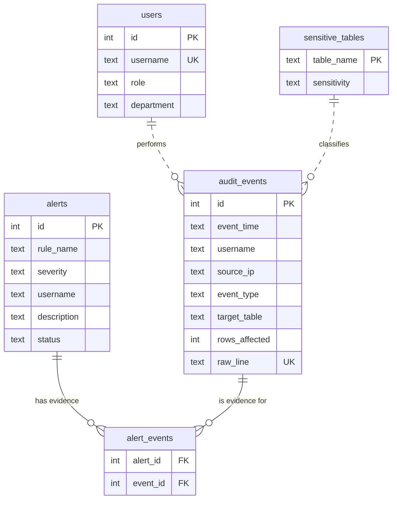

# AuditSentinel

**Database audit log anomaly detector.** AuditSentinel ingests database audit logs, validates and stores them in a relational database, and runs detection rules that flag suspicious activity such as brute-force logins, data exfiltration, privilege escalation and mass deletion. Every alert is linked to the exact log events that caused it.

The simulated environment is modelled on a government treasury system, with accounts payable, payroll and bank account data, which is the kind of system where database misuse does the most damage.

> 🚧 **Status:** Phases 1 to 4 complete (schema, ingestion, detection, dashboard). Tests, Docker and PostgreSQL support are in progress.

---

## What it detects

| Rule | Severity | What it looks for |
|---|---|---|
| `brute_force_login` | High / **Critical** | 10+ failed logins for one account from one IP within 5 minutes. Escalates to critical if a successful login follows. |
| `external_ip_access` | Medium / High | Any activity from an IP outside the internal network. |
| `off_hours_sensitive_access` | Medium / High | Reads or writes on sensitive tables outside 07:00 to 19:00, Monday to Friday. |
| `bulk_data_read` | High / **Critical** | A single `SELECT` returning 10,000+ rows (possible exfiltration). Critical on high-sensitivity tables. |
| `unauthorized_privilege_change` | **Critical** | `GRANT` or `REVOKE` by any account that is not an admin, including unknown accounts. |
| `mass_delete` | High | A single `DELETE` affecting 500+ rows. |

On the included sample data, AuditSentinel finds all five planted attack scenarios with **zero false positives** across more than 530 normal events.

---

## How it works

```
generate_logs.py  →  logs/audit_log.jsonl  →  ingest.py  →  SQLite database  →  detect.py  →  alerts
   (simulate)            (raw log file)        (validate)      (audit_events)      (6 rules)    (+ evidence)
```

1. **Generate:** `generate_logs.py` simulates a week of database activity for seven staff across Treasury, Accounts Payable, Payroll, IT and Internal Audit, with five attack scenarios hidden in the normal traffic.
2. **Ingest:** `ingest.py` validates each log line (JSON structure, timestamp, IP address, action type, row count) before it reaches the database. Invalid lines are written to `logs/rejected.log` with the reason, so nothing is dropped silently.
3. **Detect:** `detect.py` runs each rule, saves new alerts, and records which events triggered each one.
4. **Investigate:** `app.py` serves a web dashboard to filter alerts, inspect their evidence, review a user's full activity timeline, and move alerts through open → investigating → closed.

### Database schema



---

## Security and design decisions

- **Parameterized queries everywhere.** Log content is treated as untrusted input. Values are always passed with `?` placeholders, never formatted into SQL, so a malicious username like `'; DROP TABLE users; --` is stored as plain text.
- **Validate before storing.** Malformed lines, invalid IPs (such as `999.1.1.1`), unknown actions and negative row counts are rejected at the boundary.
- **No silent data loss.** Every rejected line is logged with its reason. In security monitoring, a dropped log line could be the evidence that matters.
- **Integrity enforced by the database.** `CHECK` constraints restrict roles, event types, severities and statuses, so bad values are refused even if application code has a bug.
- **Idempotent processing.** A `UNIQUE` index on the raw log line and evidence-based alert de-duplication mean ingestion and detection can be re-run safely without duplicates.
- **Atomic ingestion.** Each batch is loaded in a single transaction: all of it is saved, or none of it.
- **Traceable alerts.** The `alert_events` table links each alert to the original events, so an analyst can always trace a finding back to the source log lines.
- **Hardened dashboard.** The web interface uses CSRF tokens on every state-changing form, whitelists all filter and status values, relies on Jinja's automatic HTML escaping to block XSS from log content, binds only to `127.0.0.1`, and keeps Flask debug mode off.
- **Tunable thresholds.** Detection thresholds are constants at the top of `detect.py`. During testing, lowering the bulk-read threshold from 10,000 to 100 rows produced more than 140 false positives on normal activity, which shows why tuning matters.

---

## Getting started

**Requirements:** Python 3.10 or newer, and Flask for the dashboard. SQLite is built into Python.

```bash
git clone https://github.com/Jody2905/auditsentinel.git
cd auditsentinel
python -m pip install -r requirements.txt

python db.py              # create the database (answer y to start fresh)
python generate_logs.py   # create logs/audit_log.jsonl
python ingest.py          # validate and load the log
python detect.py          # run the detection rules
python app.py             # start the dashboard at http://127.0.0.1:5000
```

On Windows, use `py` instead of `python` if `python` isn't recognized.

To see input validation in action:

```bash
python ingest.py test_bad_lines.jsonl
```

This loads 1 valid line and rejects 6 malformed ones; the reasons appear in `logs/rejected.log`.

### Sample output

```
Detection complete: 6 new alert(s).

Open alerts: 6
----------------------------------------------------------------------
#1   [CRITICAL] brute_force_login
      25 failed logins for 'kbaptiste' from 185.220.101.47 within 5 minutes,
      followed by a SUCCESSFUL login - account likely compromised.
      Evidence: 26 event(s)

#4   [CRITICAL] bulk_data_read
      'rcharles' read 48,210 rows from 'payroll' (high sensitivity) at 2026-10-08T15:05:00.
      Evidence: 1 event(s)

#5   [CRITICAL] unauthorized_privilege_change
      'sdaniel' (role: analyst) ran GRANT on 'vendor_payments' at 2026-10-08T16:22:00.
      Only admins should change permissions.
      Evidence: 1 event(s)
...
```

---

## Project structure

```
auditsentinel/
├── schema.sql             # tables, constraints and indexes
├── db.py                  # connection helper, database setup and seed data
├── generate_logs.py       # simulated audit log with planted attacks
├── ingest.py              # validates and loads log files
├── detect.py              # detection rules and alert storage
├── app.py                 # Flask dashboard
├── templates/             # dashboard pages (alerts, alert detail, user timeline)
├── static/style.css       # dashboard styling
├── requirements.txt
└── test_bad_lines.jsonl   # malformed lines for testing validation
```

---

## Roadmap

- [x] Phase 1: Schema design and simulated audit logs
- [x] Phase 2: Validated, idempotent ingestion
- [x] Phase 3: Detection engine with six rules and linked evidence
- [x] Phase 4: Flask dashboard to view, filter and triage alerts
- [ ] Phase 5: Unit tests (pytest), Docker, and PostgreSQL support

---

## Author

**Jody-Ann Trimmingham**, B.S. Computer Networks and Cybersecurity
GitHub: [@Jody2905](https://github.com/Jody2905)
